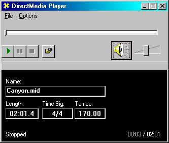



## DirectX Media Player

### Description

Did you listen to a MIDI file on two different computers and wonder why yours sounded much worse(or better)? This code, using DirectMusic, will play ANY MID file in a way you've never heard it before, in exactly the way the composer wanted it to sound! This program has a media player look, tells you time signature, length of the music, tempo, and even has a slider for the play time! The DirectX initialization code was taken from the Microsoft VB example. All other code is mine. If anyone would like to help me get a better "media player" look, or help me with buffering/seeking through a music file, email webmaster@programmerfaq.com
 
### More Info
 
You need the DirectX 7 SDK to run this code. It is available for free at www.microsoft.com/directx. Have fun downloading it, it's a 122 MB file :)

             |
---                |---
**Submitted On**   |2000-04-25 13:58:28
**By**             |[Michael Barnathan](https://github.com/Planet-Source-Code/PSCIndex/blob/master/ByAuthor/michael-barnathan.md)
**Level**          |Advanced
**User Rating**    |5.0 (20 globes from 4 users)
**Compatibility**  |VB 5\.0, VB 6\.0
**Category**       |[DirectX](https://github.com/Planet-Source-Code/PSCIndex/blob/master/ByCategory/directx__1-44.md)
**World**          |[Visual Basic](https://github.com/Planet-Source-Code/PSCIndex/blob/master/ByWorld/visual-basic.md)
**Archive File**   |[CODE\_UPLOAD51894252000\.zip](https://github.com/Planet-Source-Code/michael-barnathan-directx-media-player__1-7571/archive/master.zip)

